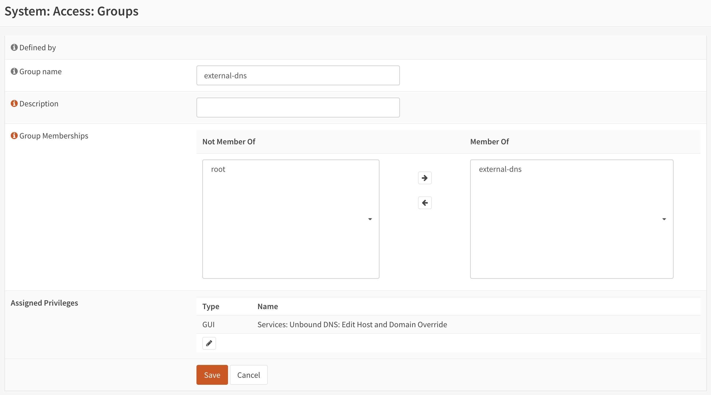

# ExternalDNS Webhook Provider for OPNsense Unbound DNS

[](https://github.com/v-yarotsky/external-dns-opnsense-unbound-webhook-provider/releases)&nbsp;&nbsp;

[ExternalDNS](https://github.com/kubernetes-sigs/external-dns) ExternalDNS synchronizes exposed Kubernetes Services and Ingresses with DNS providers. This webhook provider enables management of OPNsense Unbound DNS records via external-dns.

## 📋 Requirements

- ExternalDNS >= v0.14.0
- OPNsense >= 24.7

## ⛵ Deployment

1. Create OPNsense credentials for external-dns.
  1. Under `System -> Groups`, create a group named `external-dns`.
  2. Edit the newly created group, and add `Services: Unbound DNS: Edit Host and Domain Override` permission under `Assigned Privileges`.
     
  3. Under `System -> Users`, create a user named `external-dns`.
     Make sure to check "Generate a scrambled password to prevent local database logins for this user.".
     Set the "Login shell" to `/usr/sbin/nologin`.
     Make the user a member of the `external-dns` group.
  4. Edit the newly create user, and add a new API key. The generated credentials will be used by this webhook provider.

2. Create namespace `external-dns` in Kubernetes.

3. In the namespace created above, create a Kubernetes secret called `external-dns-opnsense-secret` that holds `key` and `secret` with their respective values from step 1.

4. Create the helm values file, for example `external-dns-opnsense-values.yaml`:

    ```yaml
    provider:
      name: webhook
      webhook:
        image:
          repository: ghcr.io/v-yarotsky/external-dns-opnsense-unbound-webhook-provider
          tag: v0.1.0
        env:
          - name: UNBOUND_API_KEY
            valueFrom:
              secretKeyRef:
                name: external-dns-opnsense-secret
                key: key
          - name: UNBOUND_API_SECRET
            valueFrom:
              secretKeyRef:
                name: external-dns-opnsense-secret
                key: secret
          - name: UNBOUND_URL
            value: https://192.168.1.1 # replace with the address of your OPNsense router
          - name: UNBOUND_DOMAIN_FILTER
            value: example.com # replace with your domain;
                               # in this example, example.com, and anything that ends with
                               # .example.com, will be managed by ExternalDNS.
    policy: sync
    domainFilters: ["example.com"] # replace with your domain
    ```

5. Install [ExternalDNS](https://kubernetes-sigs.github.io/external-dns/latest/charts/external-dns/).

    ```sh
    helm install external-dns external-dns/external-dns -f external-dns-opnsense-values.yaml -n external-dns
    ```
